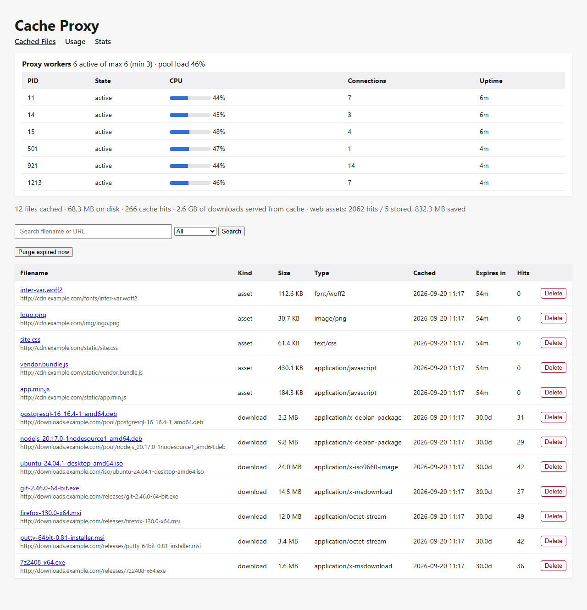
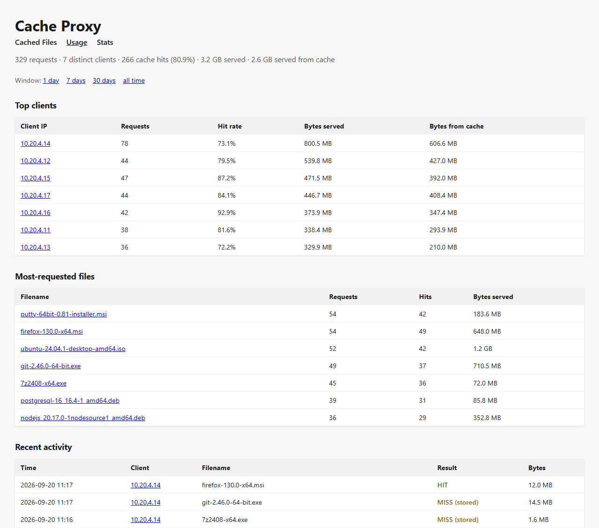
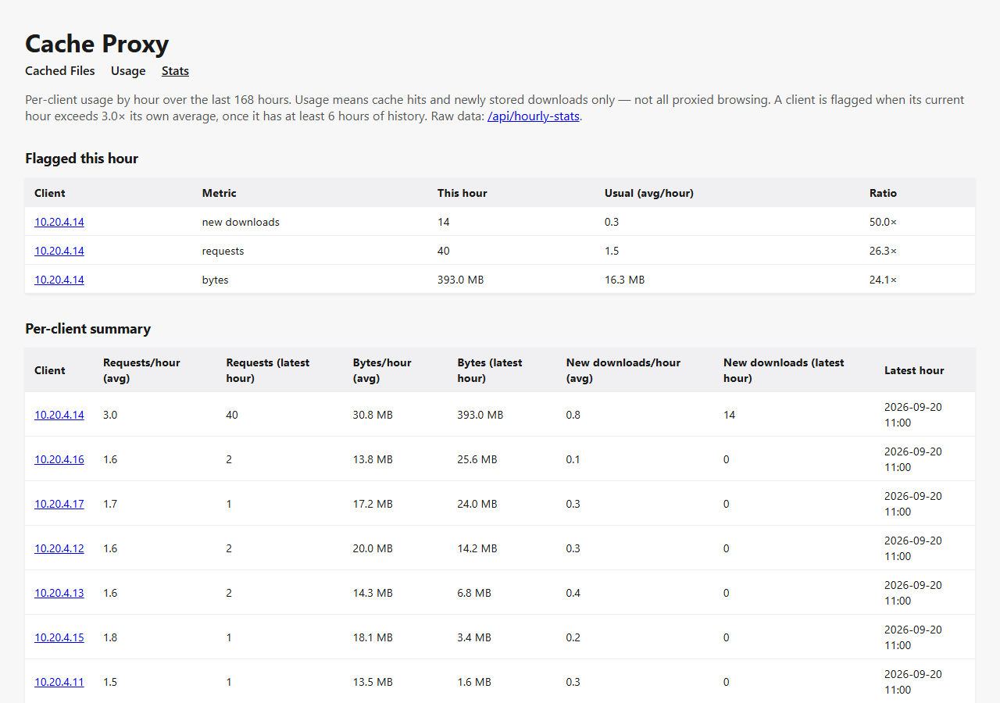

# Web interface

The web UI is a small password-protected site for looking at what the proxy
has cached, who is using it and how the worker pool is doing. It also has a
small JSON API.

It listens on **HTTPS port 443** by default (`[webui] port` in
`config.toml`). On a fresh install it uses a self-signed certificate, so your
browser will warn on first visit. See [configuration](configuration.md#webui)
to set a login and to use your own certificate.

> The screenshots below are from a demo instance filled with made-up traffic
> (seven imaginary clients on `10.20.4.x`, and a stand-in download server).
> They show what each page looks like, not real usage.

- [Signing in](#signing-in)
- [Cached files (`/`)](#cached-files-)
- [Usage (`/usage`)](#usage-usage)
- [Stats (`/stats`)](#stats-stats)
- [JSON API](#json-api)
- [Security notes](#security-notes)

---

## Signing in

Every page and every API endpoint uses HTTP Basic authentication. Your
browser shows its own login prompt. The username and a PBKDF2 password hash
come from `[webui]` in `config.toml`.

If no username and password hash are configured, **every request is
refused with a 401**. The UI never falls back to running open. Until you set
a login you will just see the browser's login prompt, and every attempt
fails. See [configuration](configuration.md#webui) for how to create the
hash.

---

## Cached files (`/`)



The main page. From top to bottom:

**Proxy workers panel.** Shows how many workers are running out of the
maximum, the minimum, and the pool's average load. Below that is one row per
worker:

| Column | Meaning |
|---|---|
| PID | The worker's process id. |
| State | `starting` (booting, not yet taking traffic), `active`, or `retiring` (being shut down after the pool went idle). |
| CPU | That worker's CPU use, where 100% is one full core. |
| Connections | Client connections that worker currently holds. |
| Uptime | How long it has been running. |

The panel refreshes itself every 5 seconds without reloading the page, so
whatever you typed in the search box is not lost. If the proxy isn't running,
or its status file is more than a few sampling intervals old, it says
**"Proxy not running / status unavailable"** instead of showing stale
numbers.

**Summary line.**

- files cached and total size on disk (and the quota, if you set one);
- total cache hits and how much download traffic was served from the cache;
- web-asset hits, how many assets are stored and how much they saved;
- how many duplicate fetches were avoided when several clients asked for the
  same new file at once (only shown once this has happened).

A highlighted **low-disk warning** appears when the cache volume has less than 10%
free space.

**Search and filter.** The search box matches part of the filename or the
URL. The dropdown limits the list to **Downloads** or **Web assets**. The
list shows the newest 500 entries.

**Purge expired now.** Immediately deletes every entry that has passed its
lifetime. This also happens automatically every hour, so you only need it to
reclaim space sooner.

**The table.**

| Column | Meaning |
|---|---|
| Filename | Click to download the cached copy. The original URL is shown underneath. |
| Kind | `download` (installers and packages, kept 30 days by default) or `asset` (scripts, styles, images, fonts, kept up to an hour). |
| Size, Type | Size on disk and the content type the origin reported. |
| Cached | When it was fetched (server local time). |
| Expires in | Time left before it must be fetched again: `59m`, `3.5h`, `30.0d`, or `expired`. |
| Hits | How many times it has been served from cache. |
| Delete | Removes that entry and its file (asks to confirm). |

> **Known quirk:** the *Hits* column is always `0` for web assets, even
> though they are being served from cache. Asset hits are only counted in
> total (the "web assets: N hits" figure in the summary line), because
> recording each one would mean a database write for every page view. The
> per-file hit count is accurate for downloads.

---

## Usage (`/usage`)



Who is using the proxy and what for. It only covers cache **hits** and newly
**stored downloads**, not all browsing (see the
[README](../README.md#1-general-download-cache-proxy) for why). Web-asset
traffic is deliberately not included here.

- **Window links** (top): 1 day, 7 days, 30 days, or all time. The default is
  7 days. In the URL this is `?days=7` (`?days=0` means all time).
- **Summary line:** requests, distinct clients, cache hits and hit rate,
  bytes served in total, and bytes served from the cache.
- **Top clients:** the 25 clients that received the most data, with requests,
  hit rate, bytes served and bytes that came from the cache. Click a client
  to filter the page to just that address (`?client=10.20.4.14`); the
  filter link shows how to clear it.
- **Most-requested files:** the 25 most-requested downloads with hits and
  bytes. Click a name to download it.
- **Recent activity:** the latest 200 requests. **HIT** means it was served
  from the cache; **MISS (stored)** means it was fetched from the internet
  and saved for next time.

The client address is whatever address connected to the proxy. If your
clients sit behind NAT or another proxy, you will see that device's address,
not the individual user's.

---

## Stats (`/stats`)



Per-client usage by the hour, with unusual activity flagged. The default
window is the last 168 hours (one week); `?hours=48` narrows it.

**How flagging works.** For each client, the page takes the client's own
average per hour over its earlier history in the window (not counting the
current hour) and compares it with the current hour. A
client is flagged if the current hour is more than `anomaly_factor` times
(default 3x) that average, on any of three measures:

| Measure | What it counts |
|---|---|
| requests | Requests served (hits plus new downloads). |
| bytes | Bytes served. |
| new downloads | Files the proxy had to fetch from the internet (misses). |

Two safeguards keep it from crying wolf: each client is compared with
**itself**, not with other clients, so a heavy user is not flagged for being
heavy; and a client needs at least `min_history_hours` (default 6) of earlier
history before it can be flagged at all, so a machine that just joined the
network is not flagged on its first hour. The average includes hours when the
client did nothing, so a client that is normally quiet and suddenly busy
stands out.

**Flagged this hour** lists each flag with the client, the measure, this
hour's value, the client's usual value per hour and the ratio. In the
screenshot, `10.20.4.14` is flagged on all three: it made 40 requests this
hour against a usual 1.5, and pulled 14 new downloads against a usual 0.3.

**Per-client summary** lists every client seen in the window, with its
average and latest-hour requests, bytes and new downloads.

It is only a flag on the page. Nothing sends an email or a message, so
someone has to look. The thresholds are in the `[analytics]` section of
[`config.toml`](configuration.md#analytics).

A high number is not proof of misuse. A person legitimately installing
several large tools at once looks the same as something unwanted, and a
re-download of the *same* cached file counts as requests and bytes but not
as a new download.

---

## JSON API

Both endpoints need the same login as the pages and return JSON.

### `GET /api/workers`

The worker pool's current state, the same data as the panel on the main page.

```json
{
  "available": true,
  "age": 1.4,
  "ts": 1789903008.06,
  "min_workers": 3,
  "max_workers": 6,
  "avg_cpu": 46.2,
  "workers": [
    { "pid": 11, "state": "active", "cpu": 44.0, "connections": 7, "uptime": 360 }
  ]
}
```

- `available` is `false` if the proxy isn't running or the snapshot is stale.
  If the status file is missing you get just `{"available": false,
  "workers": []}`; if it exists but is old you get its last contents with
  `available` set to `false` and `age` showing how old it is. Don't act on
  the numbers when `available` is `false`.
- `age` is how many seconds old the snapshot is (only present when a status
  file exists).
- `cpu` is a percentage of one core, so a busy worker sits near 100. `avg_cpu`
  is the mean over active workers.
- `uptime` is in seconds. `state` is `starting`, `active` or `retiring`.

### `GET /api/hourly-stats`

The raw hourly series behind the stats page, plus the current flags.

Query parameters (both optional): `hours` (window, default 168) and `client`
(an IP address, to restrict the series to one client).

```json
{
  "hours": 168,
  "series": {
    "10.20.4.14": [
      { "client_ip": "10.20.4.14", "hour": 1789898400,
        "requests": 3, "hits": 2, "bytes": 31457280, "new_downloads": 1 }
    ]
  },
  "anomalies": [
    { "client_ip": "10.20.4.14", "metric": "bytes", "hour": 1789902000,
      "value": 412316860, "baseline": 17091010.5, "ratio": 24.1 }
  ]
}
```

- `hour` is the start of the hour as a Unix timestamp (seconds). Hours in
  which a client did nothing have no entry.
- In each entry, `requests` = `hits` + `new_downloads`.
- `anomalies` holds only flags for the **current** hour, and is empty when
  nothing is unusual. `metric` is one of `requests`, `bytes`, `new_downloads`.
  `baseline` is the client's usual value per hour and `ratio` is `value` divided
  by `baseline`.

**Grafana.** The data is meant to be usable from Grafana's JSON API style of
data source (with basic authentication and your certificate trusted). I have
not tested this against a real Grafana. Note the series comes back keyed by
client rather than as a flat table, so expect to need a transformation
step to turn it into panels.

### Actions

These are form posts used by the buttons on the pages (they need the same
login): `POST /delete/{hash}` deletes one entry, `POST /purge-expired` purges
expired entries, and `GET /download/{hash}` downloads a cached file. `{hash}`
is the entry's identifier, visible in the download links.

---

## Security notes

- Login is HTTP Basic over HTTPS. Use a certificate your browsers trust so
  the connection can't be silently intercepted.
- There is **no lock-out or rate-limiting** on failed logins, and no audit log
  of who deleted what. Keep the UI reachable only from a management network.
- The delete and purge buttons are plain authenticated form posts with **no
  CSRF token**. A logged-in administrator who visits a malicious page could
  in principle have a delete triggered. The damage is limited (cached files
  are re-fetched on demand), but it is another reason to keep the UI on a
  restricted network.
- There is a single account. There are no roles, so anyone who can sign in
  can delete cache entries.
